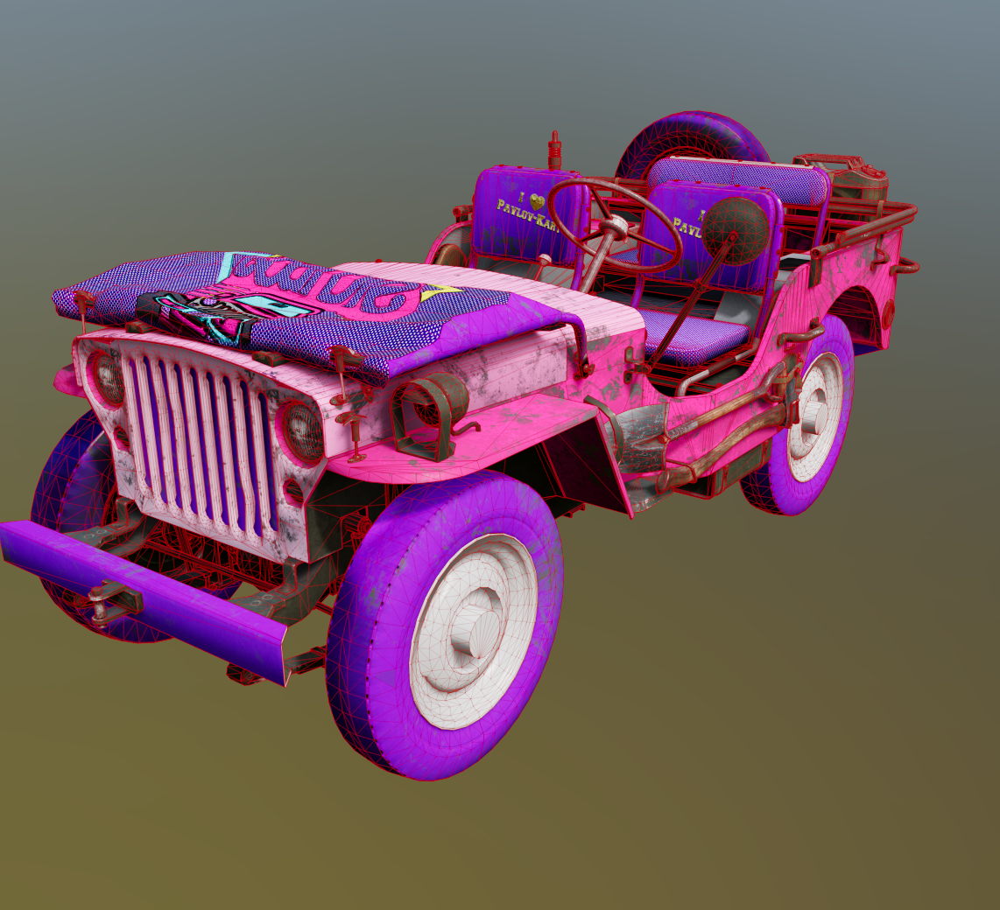
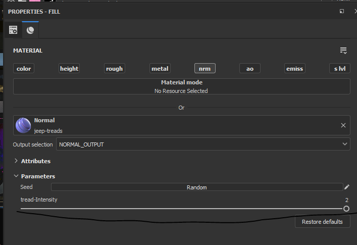
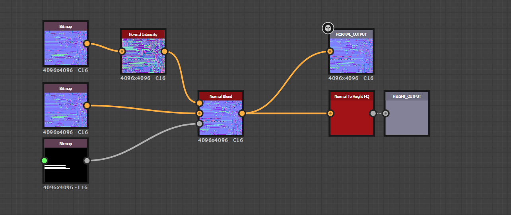
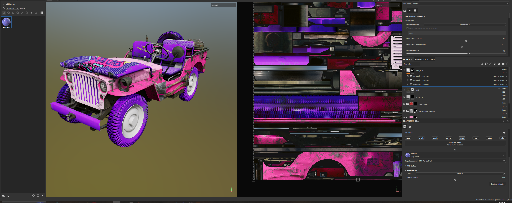
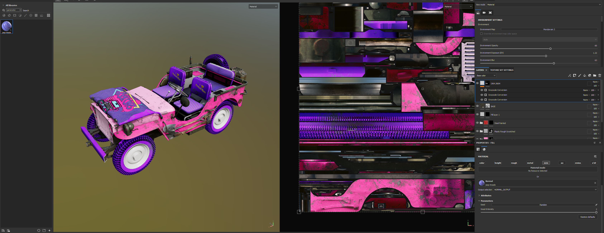

# jeep-treads
when making skins for Pavlov-VR jeep it has bald tires this lets u fix it  

hey so i made a thingy that lets u edit  the intensity on the jeep wheels its really kinda pointless and im sure most ppl never even noticed how bald there tires are but i care about your safety   

it only edits the read sction of the tire so it wont make other things look bad 
file too big for git :( its on discord sorry 
https://cdn.discordapp.com/attachments/928804473399300096/1162931416208781492/jeep-tread.sbsar?ex=653dbb47&is=652b4647&hm=3364a15e0b60aed510e299621117ad95eb8a695538885e5f1ff2433e4e8bb05f&

here is the default jeep tread 

download sbsar 

import into substance painter as generator use this file as the normal on the jeep then uuse the bar to change the value 
   

